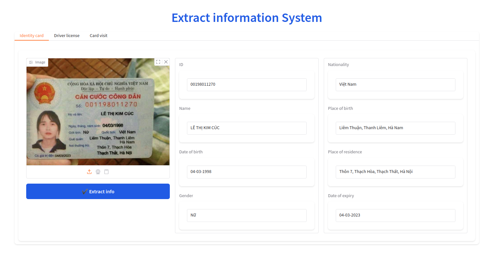
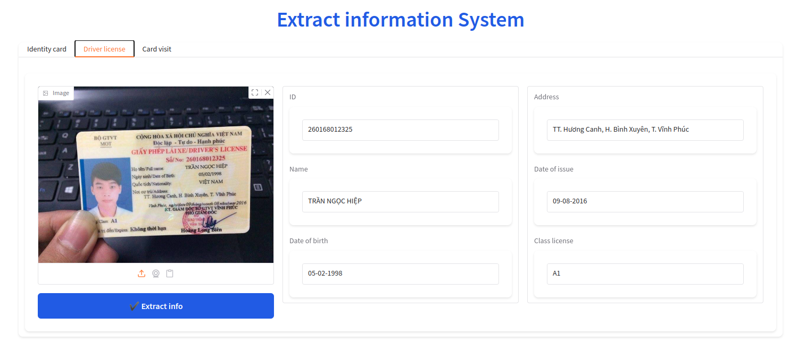
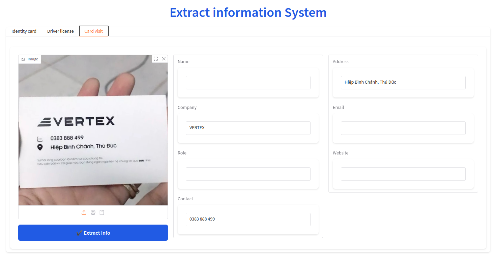

# Extract Information System





## Overview
Extract Information System is a tool that automatically extracts personal information from images of various identification documents, including:
- Citizen Identity Cards
- Driver's Licenses
- Business Cards

The system analyzes the uploaded image and populates relevant fields with extracted information, making document processing faster and more efficient.

## Features
- Document type selection (Identity card, Driver license, Card visit)
- Automatic text extraction from images
- Field mapping for different document types
- User-friendly interface for reviewing and editing extracted information

## Technologies
- **Gradio**: For building the interactive web interface
- **Pollination.ai**: For image processing and text extraction capabilities

## Installation

### Environment Setup
1. Install UV (Python package installer)
```bash
pip install uv
```

2. Create a new environment
```bash
uv venv
```

3. Activate the environment
```bash
# On Windows
.venv\Scripts\activate

# On macOS/Linux
source .venv/bin/activate
```

### Install Dependencies
```bash
uv pip install gradio pollinations pollinations.ai
```

## Running the Project
```bash
python app.py
```
After running the command, the web interface will be accessible at http://localhost:7860 (or another port if specified).

## Usage
1. Select the document type (Identity card, Driver license, or Card visit)
2. Upload or drag-and-drop an image of the document
3. Click "Extract info" button
4. Review and correct the extracted information if needed

## License
[MIT License](LICENSE)
